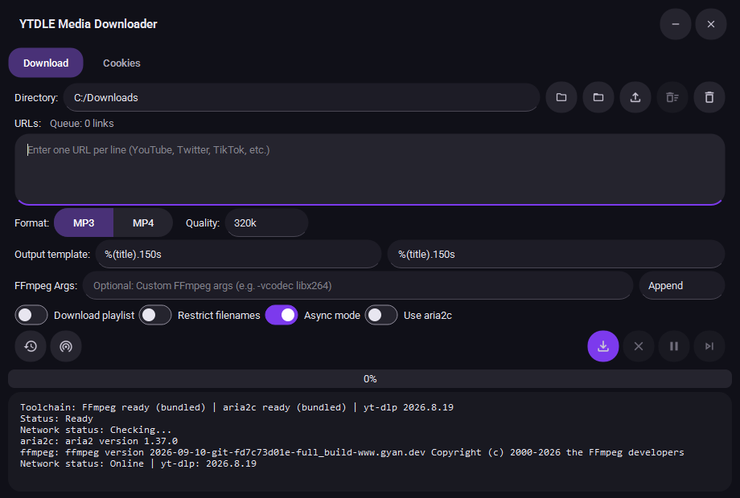

# YTDLE Media Downloader

YTDLE is a modern, cross-platform media downloader built with Python and PySide6 (Qt). It provides a graphical interface for `yt-dlp`, allowing users to download videos and audio from thousands of supported sites including YouTube, Twitter, TikTok, and more.



*Native Windows capture with a temporary, generic output path; no download was started.*

## Features

- **Dark Material 3 Expressive-inspired UI**: Roboto type, pill-shaped filled fields with a purple focus line, tonal surfaces, and icon-only actions with tooltips and accessible names.
- **Async Download Engine**: High-performance asyncio-based downloader with lower memory overhead and better concurrency.
- **CLI Mode**: Full command-line interface for headless usage or scripting.
- **Format Selection**: Easily switch between MP3 (Audio) and MP4 (Video) formats.
- **Quality Control**: Select specific bitrates for audio or resolution caps for video (up to 4K/8K).
- **Aria2c Integration**: Optional multi-connection downloading for 3-5x faster speeds.
- **Toolchain Readiness**: GUI surfaces detected FFmpeg, aria2c, and yt-dlp status before a download starts.
- **Custom FFmpeg Args**: Pass custom flags directly to FFmpeg (via GUI or CLI).
- **Batch Processing**: Download multiple URLs concurrently with a queue system.
- **Smart URL Queue**: Import UTF-8 link lists, detect malformed entries, and skip duplicate URLs before downloading.
- **Playlist Support**: Option to download entire playlists or channels.
- **Smart Naming**: Customizable output filename templates (e.g., Uploader - Title).
- **Robust Error Handling**: Automatic retries and fallback logic for different formats.
- **Logging**: Detailed file logging for troubleshooting; the on-screen log keeps only its latest 1,500 lines to cap UI memory.
- **Download History**: Persistent SQLite-based history tracking with export and retry failed downloads.
- **Network Detection**: Real-time network connectivity monitoring with manual check capability.
- **Download Controls**: Pause, resume, skip, and cancel downloads with thread-safe controls.
- **Release Hygiene**: Bundled binaries stay local, with tracked provenance and checksum guidance.

## Requirements

- **Python 3.10+**
- **FFmpeg**: Required for audio extraction and format merging. The `ffmpeg.exe` binary must be available in the system PATH or placed alongside the application executable.
- **Aria2c** (Optional): For multi-connection downloads. Download from [aria2 releases](https://github.com/aria2/aria2/releases).

## Installation & Running from Source

1.  **Clone the repository**:
    ```bash
    git clone https://github.com/Master0fFate/ytdle.git
    cd ytdle
    ```

2.  **Install dependencies**:
    ```bash
    pip install -r requirements.txt
    ```

3.  **Run the application**:
    ```bash
    python main.py
    ```

4.  **Run tests**:
    ```bash
    pip install -r requirements-dev.txt
    python -m pytest
    python -m ruff check .
    ```

## Usage

### Graphical Interface (GUI)
Run `YTDLE.exe` or `python main.py` to launch the dark GUI. Hover over an icon to see its action, or use the keyboard: `Ctrl+Enter` starts, `Ctrl+L` focuses the link list, and `Esc` cancels. Format and setting choices keep visible labels.

**New Options:**
- **Async Mode**: Enable high-performance asyncio download engine (default: enabled)
- **Use Aria2c**: Enable multi-connection downloads for faster speeds (requires aria2c binary)
- **Queue Tools**: `Import List` accepts one HTTP(S) link per line; `Clean Queue` removes invalid, duplicate, and `#` comment lines.
- **Keyboard Shortcuts**: `Ctrl+Enter` starts downloads, `Ctrl+L` focuses the URL queue, and `Esc` requests cancellation.

### Command Line Interface (CLI)
You can use the **same** executable for CLI operations. Every command shares settings and history with the GUI.

**Basic Usage:**
```bash
YTDLE.exe --url "https://youtube.com/watch?v=..."
YTDLE.exe download --url "https://youtube.com/watch?v=..." -f mp4 -q 1080p
```

**Commands:**

| Command | Description |
| :--- | :--- |
| `download` | Batch-download URLs (the default when omitted) |
| `retry-failed` | Retry every failed history record |
| `history` | List, search, export, or clear download history |
| `check-network` | Test the network endpoint the app uses |
| `tools` | Show yt-dlp, FFmpeg, and aria2c paths and versions |
| `settings` | Show or save the GUI-compatible download settings |

**Common download options:**

| Argument | Description | Example |
| :--- | :--- | :--- |
| `--url` | One URL; repeat the flag for a batch | `--url "url1" --url "url2"` |
| `-i`, `--input` | One or more inline URLs | `-i "url1" "url2"` |
| `--input-file` | UTF-8 URL list file, or `-` for stdin | `--input-file urls.txt` |
| `-od`, `--output-dir` | Output directory (default: saved GUI selection) | `-od "C:\Downloads"` |
| `-f`, `--format` | Format (`mp3` or `mp4`) | `-f mp4` |
| `-q`, `--quality` | MP3 `320k`–`128k` or MP4 `Best`–`360p` | `-q 1080p` |
| `-p`, `--playlist` / `--no-playlist` | Playlist handling | `-p` |
| `-r`, `--restrict-filenames` | ASCII-safe file names | `-r` |
| `-t`, `--output-template` | yt-dlp filename template | `-t "%(uploader)s - %(title)s"` |
| `--cookies-from-browser` | Read cookies from a browser | `--cookies-from-browser chrome` |
| `--cookies-file` | Use a Netscape cookies.txt file | `--cookies-file cookies.txt` |
| `--no-cookies` | Send no cookies | `--no-cookies` |
| `--ffmpeg-args` + `--ffmpeg-mode` | Custom FFmpeg flags (append or override) | `--ffmpeg-args "-vn" --ffmpeg-mode override` |
| `--aria2c` / `--no-aria2c` | aria2c external downloader | `--aria2c --connections 16` |
| `--concurrent-downloads` | Async engine workers (1-32) | `--concurrent-downloads 4` |
| `--no-check-certificate` | Disable TLS certificate checking | `--no-check-certificate` |
| `-v`, `--verbose` | Detailed engine status and logs | `-v` |

Run `YTDLE.exe COMMAND --help` for every flag of a command.

**Examples:**

Download a video as MP4 (1080p) to a specific folder:
```bash
YTDLE.exe --url "https://youtu.be/..." -f mp4 -q 1080p -od "C:\MyVideos"
```

Download a playlist as MP3 (320k):
```bash
YTDLE.exe --url "https://youtube.com/playlist?list=..." -f mp3 -q 320k -p
```

Download every URL from a file with browser cookies:
```bash
YTDLE.exe download --input-file urls.txt --cookies-from-browser firefox
```

Retry every failed download:
```bash
YTDLE.exe retry-failed --retries 20
```

List the last 10 completed downloads as JSON:
```bash
YTDLE.exe history --status completed --limit 10 --output json
```

## Compiling to Executable

For a release-grade Windows EXE, install `requirements.txt` and `requirements-dev.txt` in one Python environment, place the verified `ffmpeg.exe` and `aria2c.exe` in the project root, and make Node.js available on `PATH`. Then run:

```bash
python build_release.py
```

The script requires the icon, both tool binaries, Node.js, the third-party notices, and the bundled Roboto font/license. It packages `yt-dlp-ejs` with its Node runtime and writes `dist/YTDLE.exe`. It fails on missing assets instead of producing an incomplete release. See `BINARY_PROVENANCE.md` for verified binary sources and checksums. The EXE is local output and is ignored by Git.

`build.bat` still offers smaller development variants. These variants are **not** equivalent to the full release: if you use a custom/manual PyInstaller command, you must also include the EJS package/runtime and notices yourself.

## Project Structure

- `core/`: Backend logic, configuration, and downloader engine.
  - `async_manager.py`: Asyncio-based download manager for high-performance concurrent downloads.
  - `yt_dlp_options.py`: Shared yt-dlp format, cookie, FFmpeg, and aria2c option policy for both engines.
  - `database.py`: SQLite database manager for persistent history storage.
  - `downloader.py`: Legacy threading-based download manager (still supported).
  - `history.py`: Download history tracking with SQLite backend and JSON fallback.
  - `config.py`: Configuration dataclasses and options.
  - `errors.py`: Custom exceptions and error classification.
  - `network.py`: Network connectivity monitoring utilities.
- `ui/`: User interface components, styles, and main window logic.
  - `components/`: Reusable UI components (History dialog, Title bar, etc.).
- `main.py`: Application entry point (handles both GUI and CLI).
- `build.bat`: Windows build script with multiple build options.
- `build_release.py`: Python release builder that includes local FFmpeg/aria2c when present.
- `requirements.txt`: Production dependencies.
- `requirements-dev.txt`: Development dependencies (testing, linting).
- `assets/`: Vendored Roboto font and its OFL license for the dark interface.
- `docs/screenshots/`: Captured application screenshots for documentation.
- `BINARY_PROVENANCE.md`: Trusted binary source and verification notes.
- `THIRD_PARTY_NOTICES.md`: Licenses and source links for bundled FFmpeg and aria2.
- `CHANGELOG.md`: Versioned release notes.
- `PRODUCT.md`: Product/design context for future UI work.

## Architecture

YTDLE uses a modular architecture with clear separation of concerns:

**Download Engine**: Choose between legacy threading (`DownloadManager`) or modern asyncio (`AsyncDownloadManager`) based on your needs. The async engine provides better scalability and lower memory usage.

**Storage**: SQLite database with WAL mode for concurrent read/write operations. Automatic migration from legacy JSON format with backup.

**External Tools**: yt-dlp handles the actual downloading, with optional aria2c for multi-connection acceleration and FFmpeg for post-processing.

## License

This project is open source. See the repository for license details.
